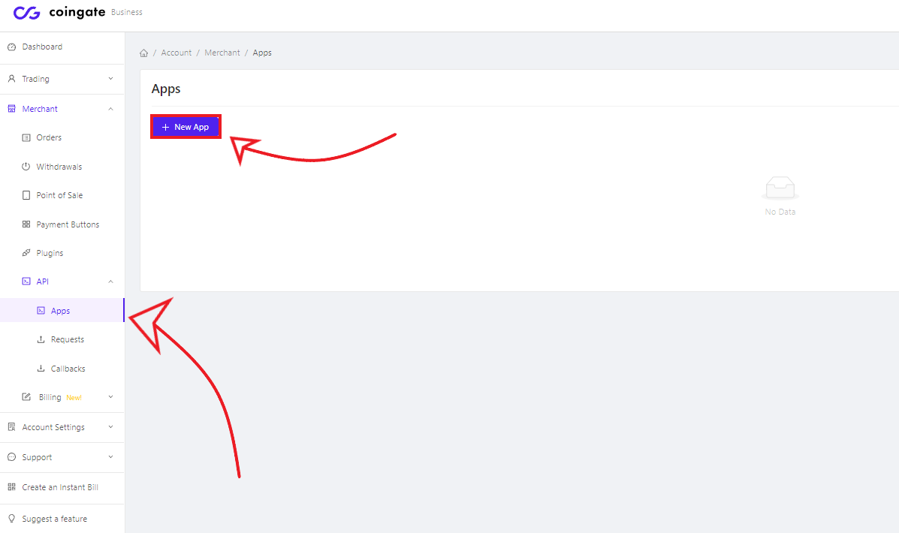
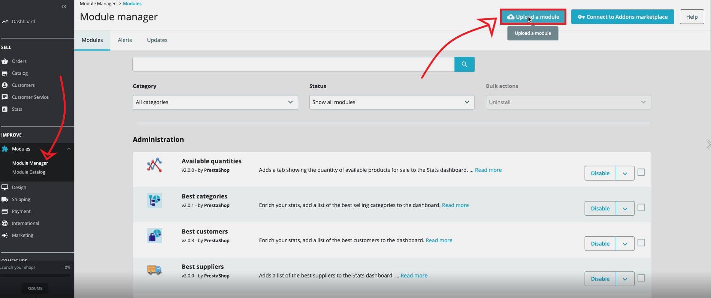
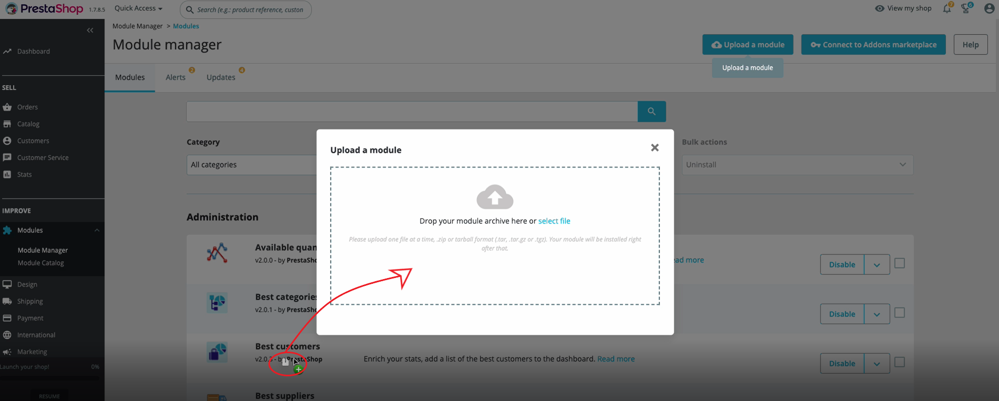
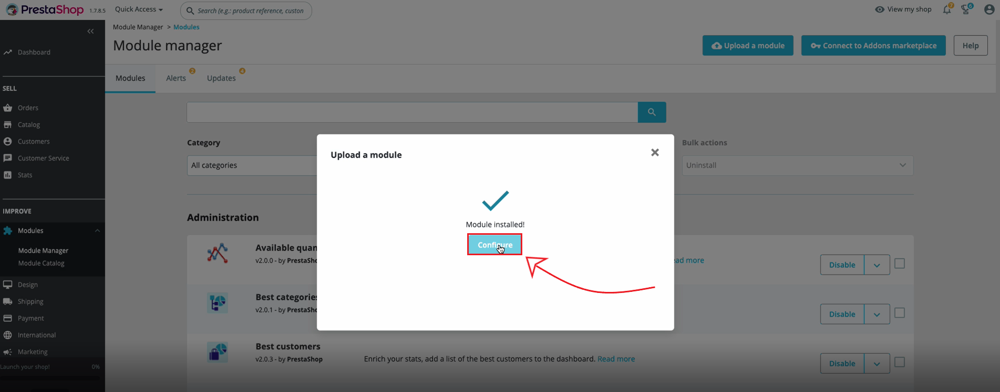
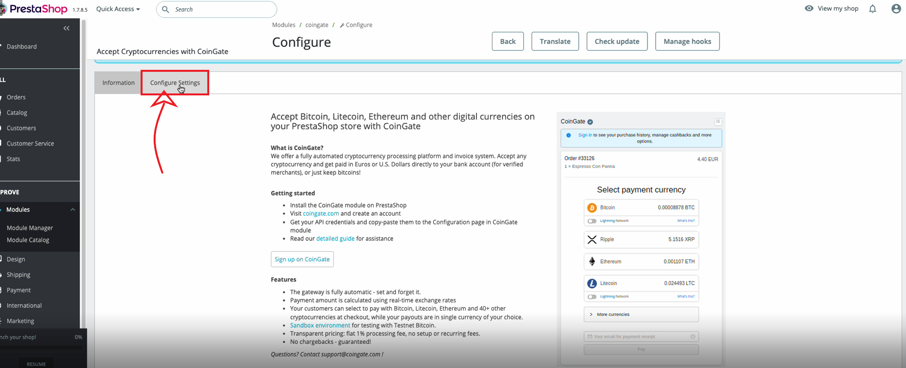

# PrestaShop CoinGate Plugin

Accept cryptocurrency payments in your PrestaShop store with [CoinGate](https://coingate.com/) - a fully automated payment processing and invoicing solution for online stores to make cryptocurrency payments easy, convenient, and risk-free for you and your customers.

Once installed, a new payment method appears in your PrestaShop store's checkout, allowing customers to pay with Bitcoin (+ Lightning⚡), Litecoin, Ethereum, Dogecoin, XRP, and 70+ other cryptocurrencies and tokens.

**Price your merchandise in any national currency** – CoinGate sources real-time exchange rates and accurately reflects them during a customer's payment cycle.

Users of this module also have access to additional features like order data tracking, an in-built refund system, invoice customization, permission-based account management, API access, and custom payouts.

Want to take the 'hands-off' approach? Set up recurring payouts of your proceeds in a single fiat currency, such as EUR, USD and GBP, directly into a bank account. This way, businesses protect themselves from price volatility risks and enjoy fixed payouts no matter how much cryptocurrencies go up or down in value.

Sign up for a [CoinGate business account](https://dashboard.coingate.com/register) to get started! The plugin is [free to download](https://github.com/coingate/prestashop-plugin/releases) and set up.

### CoinGate charges merchants a flat payment processing service fee of 1%.

**Plugin is compatible with PrestaShop 1.7+ or PrestaShop 8+ versions**

### Features:
* A simple, one-time setup with little-to-no maintenance needed;
* Instant payment confirmations and order status updates;
* Pricing of merchandise in any local fiat currency;
* Issuing full and partial refunds manually and automatically;
* Permission-based account management tools;
* Bitcoin Lightning Network support;
* Payouts in stablecoins, BTC, other cryptos, or fiat currencies (EUR/GBP/USD);
* Mitigation of cryptocurrency market volatility;
* [Sandbox environment](https://sandbox.coingate.com)  for testing the gateway’s functionality.

### Functionality:
* Accept slight underpayments automatically.
* Refunds can be issued directly from the invoice and without the involvement of the seller.
* Change the [invoice](https://coingate.com/blog/post/how-to-customize-merchants-invoice-guide) settings: disable/enable coins, switch positioning, settlements, & more;
* Manage [payout options](https://coingate.com/blog/post/payouts-fiat-settlements) for each accepted cryptocurrency.

###  Reasons to accept cryptocurrency payments
* Collect payments instantly from anywhere in the world;
* Get rid of multiple unnecessary middle-men;
* Gather and share fewer data about your customers;
* No more fraudulent chargebacks on purchases;
* Get the attention of more customers;
* Gain a competitive advantage in your respective industry.

### How it work?
1. An item in the store costs 100 EUR.
2. A customer wants to buy the item and selects to pay with Bitcoin.
3. An invoice is generated and, according to the current exchange rate, the price is 10,000 EUR per BTC, so the customer pays 0.01 BTC.
4. Once the invoice is paid, the merchant receives 99 EUR (100 EUR minus a 1% flat fee), or 0.0099 BTC.

### Testing

Sign up for a [CoinGate Sandbox account](https://sandbox.coingate.com) to access the testing environment.

Please note that for "Test" mode, you must generate separate API credentials on [https://sandbox.coingate.com](https://sandbox.coingate.com). API credentials generated from a regular CoinGate business account will not work in a testing environment.

## CoinGate module installation guide via PrestaShop FTP Uploade

### 1. Create a CoinGate business account

This module requires you to have a verified CoinGate business account. [Start here.](https://coingate.com/register)

### 2. Download the module
The PrestaShop module can be downloaded from [here](https://github.com/coingate/prestashop-plugin/releases).

### 3. Create the API Auth Token on your CoinGate business account

Generate the API credentials (API Auth Token) when logged into the CoinGate account **(Merchant > API > Apps > +New App)**.

### 4. Install the module from your PrestaShop dashboard

Go to your PrestaShop admin panel, navigate to **Modules > Module Manager**, and click the **‘Upload the Module’** button.

Drag the downloaded file to upload, or click **‘select file’**, find the downloaded file, and click **‘Open’**. The installation process will begin.

### 5. Configure API settings
Once the module has finished installing, click the **‘Configure’** button that pops up right after.

Then, navigate to the module’s settings page (**Modules > CoinGate > Configure**) and click the **‘Configure Settings’** button. 

Enter your API credentials (or Auth Token) generated on your CoinGate business account. 

Lastly, set the **‘Payout Currency’** parameter to whatever currency, cryptocurrency or fiat, you wish to receive when payouts come in.

### 6. Add payout address
You must indicate a bank account or wallet address to receive payouts. Log into your CoinGate account, navigate to **Account Settings > Payout Settings** and add the payout address of a currency you set as **‘Payout Currency’** in step #4.